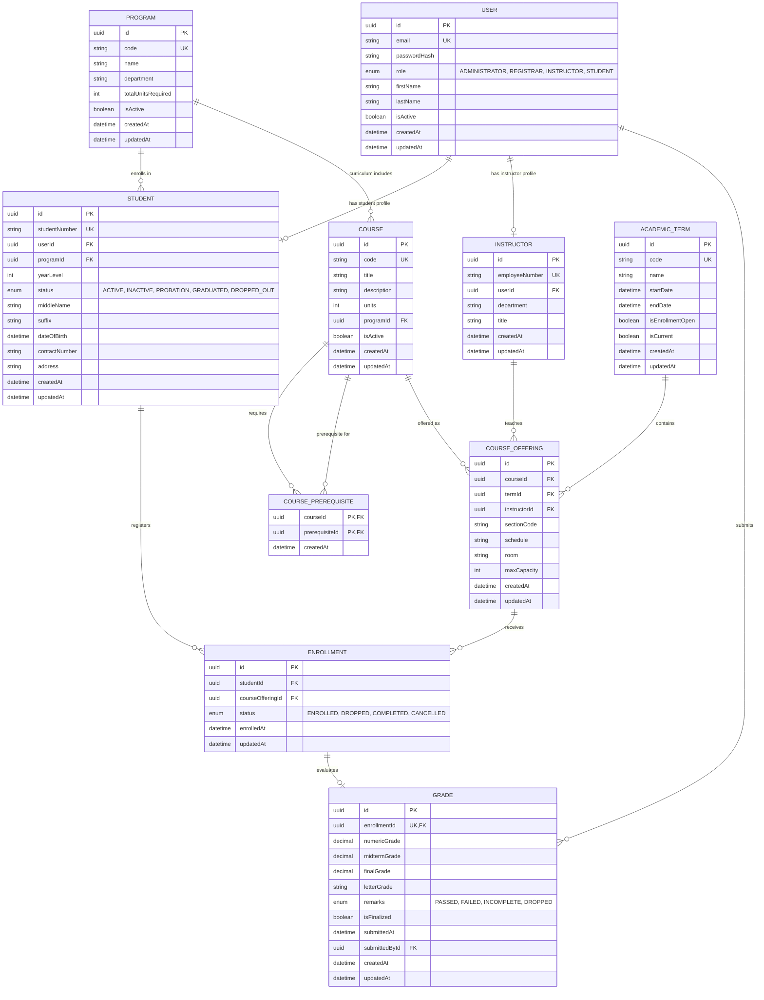

# Entity Relationship Diagram (ERD)
### Student Information Management System (SIMS) REST API

This document describes the relational database schema, entities, primary keys, foreign key constraints, and relationships for the Student Information Management System.

---

## 1. Visual Entity Relationship Diagram (Mermaid)

---

## 2. Cardinality & Relationship Breakdown

1. **User $\leftrightarrow$ Profiles (1:1 optional)**:
   - A `User` represents the core authentication principal.
   - If `role == "STUDENT"`, it connects 1:1 with `Student` (Cascade delete).
   - If `role == "INSTRUCTOR"`, it connects 1:1 with `Instructor` (Cascade delete).
2. **Program $\leftrightarrow$ Student (1:N)**:
   - One Academic Program has many enrolled Students.
   - Deletion of a Program is restricted (`onDelete: Restrict`) if active students are registered.
3. **Course $\leftrightarrow$ Offerings (1:N)**:
   - One Course blueprint may be offered across multiple Academic Terms as distinct sections.
4. **Academic Term $\leftrightarrow$ Offerings (1:N)**:
   - One term contains multiple course offering sections with scheduling and capacity limits.
5. **Instructor $\leftrightarrow$ Offerings (1:N optional)**:
   - An instructor is assigned to teach multiple course offering sections.
6. **Student $\leftrightarrow$ Enrollments (1:N)**:
   - A student registers for multiple course offerings across their academic stay.
7. **Course Offering $\leftrightarrow$ Enrollments (1:N)**:
   - A course offering section receives student enrollments up to `maxCapacity`.
8. **Enrollment $\leftrightarrow$ Grade (1:1 optional)**:
   - An enrollment produces at most one official grade evaluation record.
   - Unique composite constraint prevents duplicate enrollments: `@@unique([studentId, courseOfferingId])`.

---

## 3. Data Integrity & Constraints

- **Unique Constraints**:
  - `User.email`
  - `Student.studentNumber`
  - `Instructor.employeeNumber`
  - `Program.code`
  - `Course.code`
  - `AcademicTerm.code`
  - `CourseOffering(courseId, termId, sectionCode)`
  - `Enrollment(studentId, courseOfferingId)`
  - `Grade.enrollmentId`
- **Check Validations & Foreign Keys**:
  - All relationship references enforce Referential Integrity.
  - Cascade deletion applies to dependent profiles when a User account is deleted.
  - Restrict deletion applies to Courses and Terms referenced in Offerings.
